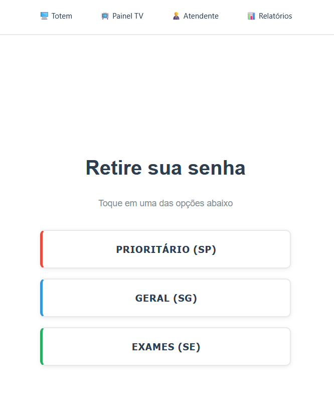
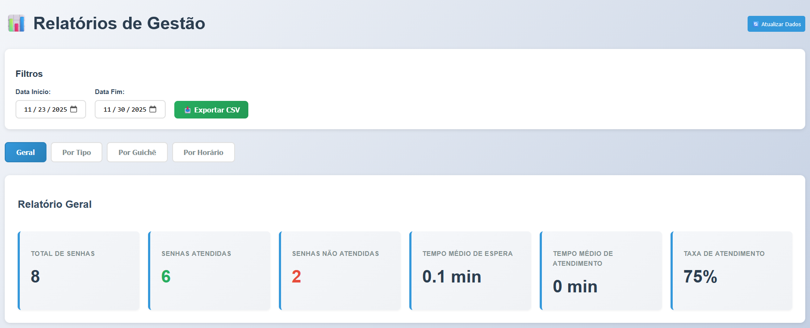

# sistemaAtendimento

Sistema de atendimento feito usando react com typescript + vite
Feito pensado para uma clínica hospitalar.

    

1. Permite imprimir senha por 3 prioridades: Geral, Prioritária e Exames

    

2. Permite a visualização do relatório contendo tempo médio geral, senhas atendidas, total de senhas, taxa de atendimento, quantitativo dos tipos de senha, relatório por guichê, horário e também a exportação de um .csv contendo o relatório.